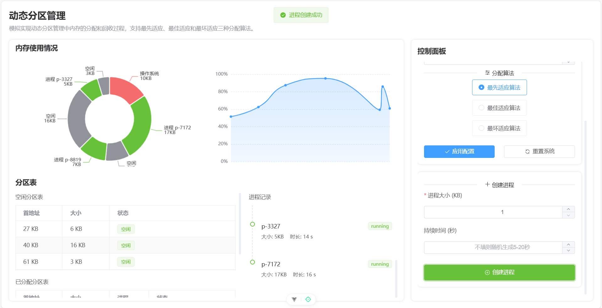

# 内存管理模拟系统 🖥️

一个用于教学和学习的内存管理可视化模拟系统，通过直观的图形界面展示动态分区管理和动态分页管理的核心概念和工作原理。

## ✨ 功能特色

本系统模拟实现了两种主要的内存管理策略：

### 1. 动态分区管理 📊

- 支持三种经典分配算法：
  - 最先适应算法 (First Fit)
  - 最佳适应算法 (Best Fit)
  - 最坏适应算法 (Worst Fit)
- 可视化展示内存分配和回收过程
- 实时更新分区表
- 内存使用率动态监控
- 进程创建与终止模拟

### 2. 动态分页管理 📑

- 实现FIFO页面置换算法
- 可视化展示页面置换过程
- 实时显示页表状态变化
- 支持物理地址计算
- 缺页中断处理模拟

## 🖼️ 运行效果

### 动态分区管理



### 动态分页管理


## 🛠️ 技术栈

- 前端框架：Vue 3
- UI组件库：Element Plus
- 状态管理：Pinia
- 图表可视化：ECharts

## 📂 项目结构

```
├── public/                  # 静态资源
├── src/
│   ├── assets/              # 资源文件
│   │   ├── samples/         # 示例图片
│   │   └── styles/          # 全局样式
│   ├── components/          # 通用组件
│   ├── router/              # 路由配置
│   ├── stores/              # Pinia状态管理
│   │   ├── partition.js     # 动态分区状态
│   │   └── paging.js        # 动态分页状态
│   ├── utils/               # 工具函数
│   ├── views/               # 页面
│   │   ├── home/            # 首页
│   │   ├── partition/       # 动态分区管理
│   │   │   └── components/  # 分区管理组件
│   │   └── paging/          # 动态分页管理
│   │       └── components/  # 分页管理组件
│   ├── App.vue              # 根组件
│   └── main.js              # 入口文件
├── .gitignore               # Git忽略文件
├── index.html               # HTML模板
├── package.json             # 项目依赖
├── README.md                # 项目说明
└── vite.config.js           # Vite配置
```

## 🚀 快速开始

### 安装依赖

```bash
pnpm install
```

### 运行项目

```bash
pnpm dev
```

## 📖 使用指南

### 动态分区管理

1. 选择分配算法（最先适应、最佳适应或最坏适应）
2. 创建新进程，指定所需内存大小
3. 观察内存分配情况和分区表变化
4. 终止进程，观察内存回收和合并过程

### 动态分页管理

1. 执行指令，观察页表状态变化
2. 查看物理地址计算过程
3. 观察缺页中断处理和页面置换过程
4. 分析FIFO队列的变化情况
